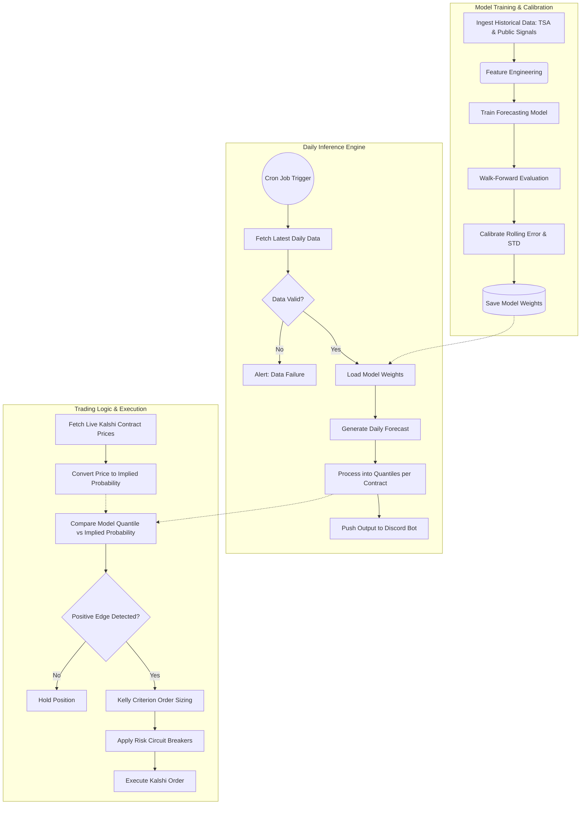
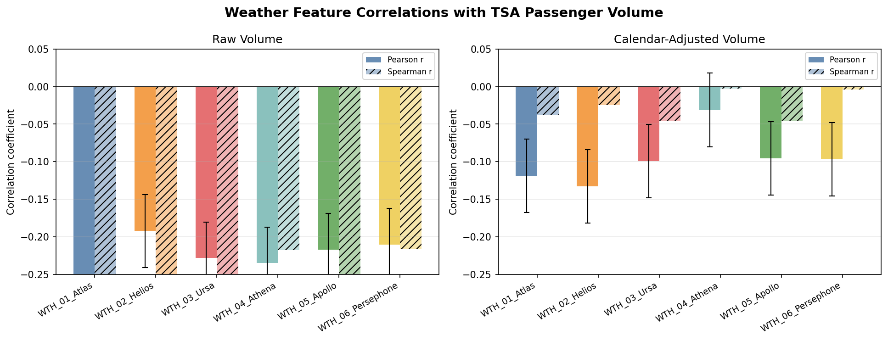
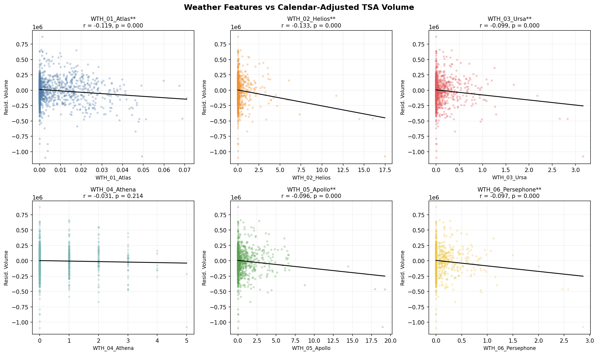

# Forecasting TSA Volume for Kalshi Markets

> _This work represents a collaborative effort by members of [ML@P](https://mlpurdue.com/)._  
> Project manager: [Eubene In](https://github.com/ubean-nn)  
> Project members: [Manit Mahajan](https://github.com/manitm204), [Josh Kim](https://github.com/Jokimessi21), [Prabhat Mani James Nayagam](https://github.com/Thesavagecoder7784), [Brody Snyder](https://github.com/bsniddy), [Mofiyinfoluwa Orekoya](https://github.com/FakeTonyV2), with collaborative efforts from [Sungmin Park](https://github.com/sungmin0405)

_This report is censored and anonymized to protect our proprietary data and pipeline. It shows the research process, the validation standard, and the kinds of signal families we are building around without exposing the features themselves, model configuration, execution thresholds, or order-sizing rules._

<i>Public-safe scope</i>

The project is not just feature engineering. The full pipeline starts with a Kalshi market, maps that market back to daily TSA passenger throughput, adds external demand and disruption signals, trains forecasting models, evaluates them through walk-forward backtests, and then feeds the forecast output into downstream trading logic. This MD currently focuses on the public research layer: the Kalshi problem framing, the TSA target variable, the Google Trends signal study, and the statistical gates we use before a candidate feature is allowed to influence the model.

What this report intentionally omits:

- Exact search terms, feature names, data sources, and feature preprocessing.
- Model hyperparameters, architecture, feature weights, and ensemble configurations.
- Live trading thresholds, sizing constants, account constraints, and execution rules.
- Raw vendor or market data that cannot be redistributed.

---

## What is Kalshi?

  

[Kalshi](https://kalshi.com/) is a prediction market for all sorts of things. Instead of buying shares of a company, people buy or sell contracts tied to a specific real-world outcome. A contract can be read as a market-implied probability: if people think an event is more likely, the "Yes" side becomes more expensive; if they think it is less likely, it becomes cheaper.

That makes this project a little different from just a normal forecasting assignment. We have to also estimate whether the market's view of a future travel outcome is too high, too low, or fairly priced after accounting for uncertainty.

The market we focus on is tied to U.S. airport checkpoint traffic. In simple terms, the market asks whether TSA passenger volume for a given week will be over or under certain thresholds.

<i>Technical note: how event contracts change the modeling objective</i>

A point forecast is only one part of the problem. To evaluate a market, we also need uncertainty: a forecast distribution, a way to compare that distribution to market-implied probabilities, and a backtest that checks whether the decision rule would have worked without future information.

This report discusses that pipeline at a high level only. Pricing conversion, live order book handling, risk limits, and sizing rules are intentionally redacted.

<i>Technical note: daily target vs. weekly contract</i>

The modeling layer tracks two related metrics:

- Daily error, which diagnoses whether the model captures the within-week travel pattern.
- Weekly-average error, which is closer to the Kalshi contract settlement surface.

This is also why backtesting is walk-forward by week. A model can look acceptable on daily averages but still be misaligned with the contract if it misses the weekly aggregate, or if it uses information that would not have been available at the decision time.

---

## Our Current Pipeline

---

## The Target

Like any machine learning/data science project, the first step is to understand the data. In this case, our target is TSA passenger throughput.

It's public, daily, and very seasonal, but there is still a lot of week-to-week variation for outside signals to matter.

The U.S. Transportation Security Administration publishes daily passenger throughput: the number of people screened at airport security checkpoints nationwide.

The structure of the data at a glance is very seasonal. TSA volume has a clear day-of-week pattern, with Sundays consistently busier than Tuesdays as an example. There is also an annual cycle: summer and holiday periods regularly produce much higher throughput than January and February. You can also visualzie the dip in travelling right around the COVID-19 pandemic.

The monthly distribution is where the forecasting problem becomes interesting. Even after controlling for the month, the range inside a given month can be wide. So a calendar-only model will capture the broad seasonal shape, but it will still miss many week-specific deviations. Those deviations are where external signals, holiday structure, and other highly engineered features can add value.

It's also the most challenging part of the problem...

  

---

## Google Trends

Google Trends, a data source surrounding google search volume, can act as an early demand signal: people often search for travel-related things before they actually fly. We tested a broad set of travel-adjacent searches, filtered out the candidates that were mostly just seasonal noise, and kept only the signals that survived our validation checks.

We found certain Google Trends terms to be useful, but only after being heavily screened. A lot of travel searches move with TSA volume simply because both rise around the same times of year. The useful signals are the ones that still carry information after we remove the obvious calendar effects.

<!--  -->

  

The broad screen gave us a quick way to rank candidates and separate "this looks related" from "this might actually help the model."

<!--  -->

  

The final summary is intentionally anonymized. It shows which signals made it through the validation process without exposing the underlying query list or exact feature recipes.

<i>Expand Google Trends Analysis</i>

Raw correlation is misleading here. Two series can both peak around July, Thanksgiving, or Christmas and look correlated even if one is not useful for forecasting the other. To avoid that, we evaluated candidate signals after removing major calendar structure from both the TSA series and each trend signal.

The validation pass emphasized:

- Residual correlation instead of raw correlation.
- Lead/lag scans to test whether a signal leads TSA, moves with it, or trails it.
- HAC/Newey-West style significance checks for serially correlated daily data.
- Benjamini-Hochberg FDR correction across the signal-by-lag testing grid.
- Directional stability after outlier handling.
- Pearson/Spearman agreement as a sanity check against a few extreme observations driving the result.

<!--  -->

  

The heatmap was the first real filter. It helped us identify which candidates had a stable relationship across nearby lead/lag alignments and which ones only looked good at one isolated point.

<!--  -->

  

After the broad screen, we moved to a smaller core study. The distributed lag profiles made timing explicit: does the candidate lead TSA volume, move at the same time, or trail it?

<!--  -->

  

Pearson and Spearman agreement gave a second robustness check. When both point in the same direction around the same lag, the signal is less likely to be driven by a few extreme observations.

Passing this study does not automatically make a candidate a production feature. A candidate still needs to be evaluated for forecast-time availability, missing-data behavior, interaction with calendar and lag features, and out-of-sample impact in model backtests.

---

## Weather

Weather plays a meaningful role in air travel demand, especially under extreme conditions. Events such as snowstorms, heavy precipitation, or severe weather can lead to flight delays and cancellations, which directly reduce TSA passenger volume. Because of this, incorporating weather data into the model helps capture short-term disruptions that are not explained by calendar effects alone.

To account for this, we integrated both **historical weather data** and **forecasted weather data** using an external API. This allows the model to learn from past weather patterns while also making forward-looking predictions. From this data, we constructed the following core weather features:

- `WTH_01_Atlas`
- `WTH_02_Helios`
- `WTH_03_Ursa`
- `WTH_04_Athena`
- `WTH_05_Apollo`
- `WTH_06_Persephone`

In addition to the base features, we also included **lagged and forward-shifted versions** (lags/leads) to capture delayed or persistent impacts of weather on travel behavior.

<i>Expand Weather Analysis</i>

## Correlation Analysis

To understand the relationship between weather and TSA volume, we analyzed both **Pearson (linear)** and **Spearman (rank-based)** correlations.

### Key Observations:
- All weather features show **consistent negative correlations** with TSA volume  
- After adjusting for calendar effects, correlations are around **-0.10 to -0.13**
- This indicates that **worse weather is associated with lower passenger volume**

While these correlations are not large, they are:
- **Stable across features**
- **Consistent in direction**
- Present in both Pearson and Spearman metrics  

This consistency suggests that weather has a **real impact** on travel volume.

## Scatter Plot Analysis

We also plotted each weather feature against **calendar-adjusted TSA volume**, along with a line of best fit.

### What this shows:
- The **negative slope** across all features confirms the inverse relationship  
- Most data points are clustered near low weather values, meaning:
  - Normal weather has little effect  
  - **Extreme weather drives the impact**
- A small number of high-weather-intensity days correspond to **notable drops in volume**

### Interpretation:
Weather does not strongly affect travel on a typical day, but during extreme conditions, it can significantly reduce passenger volume. This results in an overall weak correlation, even though the effect is meaningful in specific scenarios.

---

## Model Performance

<!--  -->

  

<i>Model Fun Facts</i>

> Google Trends and weather are not the only features we've collected and engineered. We've actually collected and generated quite a few bringing one of our models' datasets to to around 6021 rows and 610 columns... 😬

> Ensamlbe approaches is one method to improve model performance. One ensamble consist of over 20 models totaling to ~105M parameters and ~4GB on disk.

> One of our production training runs starting with, evaluation, calibrating, and final training took around 30 hours on a 3070ti...

This is the running model leaderboard for our team. Lower Daily MAE is better and MAPE and Weekly MAE are supporting diagnostics when they are available. These models span the work done by the team for about one and a half semesters.

We also developed an internal backtester to test each model. The models we use for backtesting are completely seperate and trained on a truncated data set. This ensures theres no leakage or overfitting when preforming inference on the test set. We also made sure to account for all platform fees, real world liquidty constraints, and built it all ontop of historical Kalshi candle data for all the realism.

We test mutliple different strategies that each all handle risk and position sizing differently. At a high level, we use a custom Kelly criterion model around the predicted probabilities, which we get from our autocorrelation-scaled variance model—which dynamically updates our daily standard deviation🤓— to determine position sizing. For clarification, each line on the graph below represent a different trading strategy across our top preforming models.

We did of course try Kelly Criterion, customized to our situation, but found it to preform not poorly, but slowly if that makes sense, in our backtests. So we moved on to other strategies that granted us more consistent returns at around a 92% winrate on the backtest.

_Again, our buying strategies are anonymized to protect our edge._

<i>Quarter Kelly Criterion</i>

This was one our first strategies developed.

Let:

- `p_above` = model probability that the event finishes **above** the threshold
- `p_below` = model probability that the event finishes **below** the threshold
- `c_yes` = market price of the **Yes** contract
- `c_no` = market price of the **No** contract
- `f*` = full Kelly fraction of bankroll
- `f_q` = quarter Kelly fraction of bankroll

### 1. If the model thinks **Yes** is underpriced

If the model probability for **Yes** is greater than the market price,

$$
p_{\text{above}} > c_{\text{yes}}
$$

then the full Kelly fraction for buying **Yes** is

$$
f^*_{\text{yes}} = \frac{p_{\text{above}} - c_{\text{yes}}}{1 - c_{\text{yes}}}
$$

and the quarter-Kelly size is

$$
f_{q,\text{yes}} = 0.25 \cdot f^*_{\text{yes}}
$$

### 2. If the model thinks **No** is underpriced

If the model probability for **No** is greater than the market price of the **No** contract,

$$
p_{\text{below}} > c_{\text{no}}
$$

then the full Kelly fraction for buying **No** is

$$
f^*_{\text{no}} = \frac{p_{\text{below}} - c_{\text{no}}}{1 - c_{\text{no}}}
$$

and the quarter-Kelly size is

$$
f_{q,\text{no}} = 0.25 \cdot f^*_{\text{no}}
$$

### 3. Trading rule

For each market:

- compute the Kelly fraction for the side we believe is underpriced
- take only **25% of the full Kelly size**
- do not trade if the computed Kelly fraction is negative or too small after filters

Not only did we backtest on historical data, but we also did live testing with paper trading.

| Date             | Portfolio Value | Cumulative PnL |
| :--------------- | :-------------- | :------------- |
| February 1, 2026 | $12.00          | $8.00          |
| Feb 8, 2026      | $20.00          | $11.00         |
| Feb 15, 2026     | $23.00          | $12.52         |
| Mar 8, 2026      | $24.52          | $18.56         |
| Mar 15, 2026     | $30.56          | $24.32         |
| Mar 22, 2026     | $36.32          | $30.08         |
| Mar 29, 2026     | $42.08          | $30.30         |
| Mar 30, 2026     | $42.30          | $30.30         |

So we found that our model was able to generate a positive return over the course of the backtest as well as real world paper trading. With portfolio growth of **748%** on the backtest and **252.5%** on two months of live paper trading. As of today, March 9th 2026, we have deployed our model to Kalshi and are live trading with real money.

---
